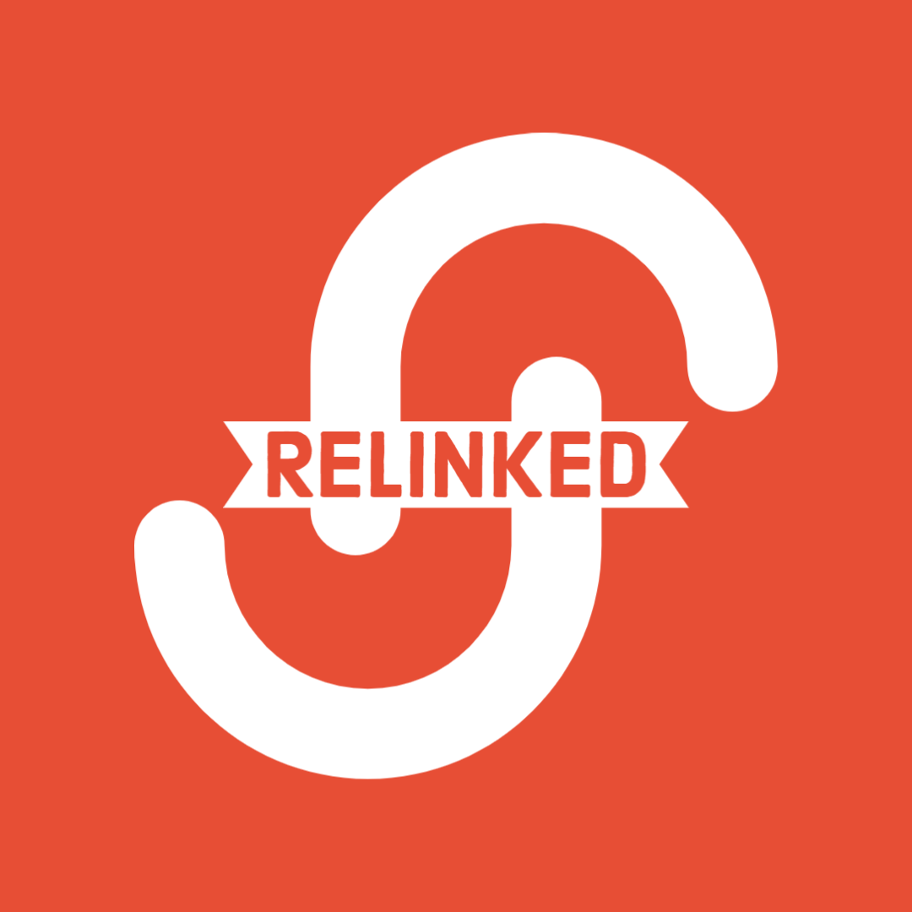
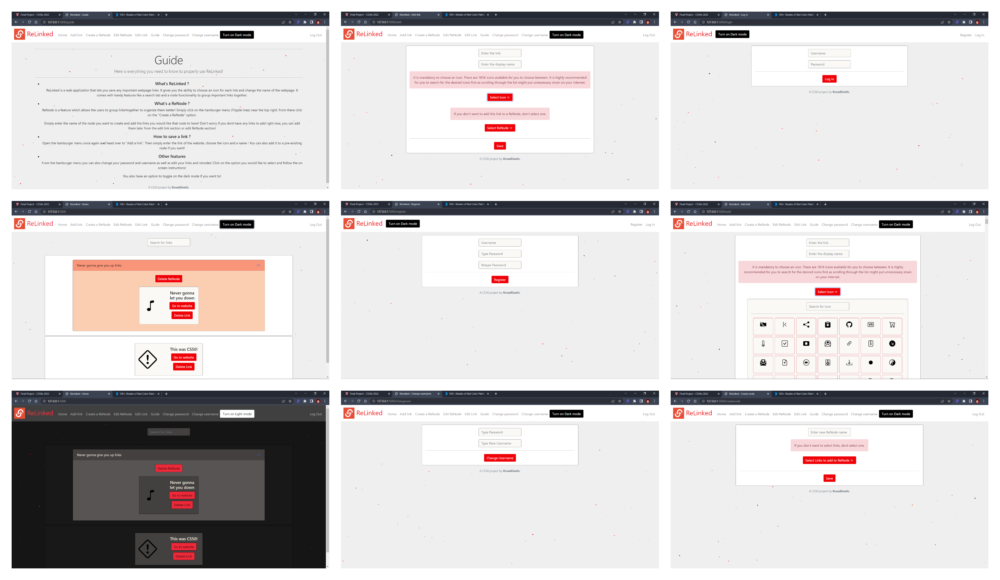

 

# ReLinked

 

# Index

1. [Video Demo](#video)

2. [Website Link ( Server Expired ) ](#link)

3. [Description](#desc)

    - [Static Folder](#static)
    - [Templates Folder](#templates)
    - [App.py](#app)
    - [Helpers.py](#helpers)
    - [Links.db](#links)
4. [Design Choices](#design)
    - [Color Theme](#color)
    - [Element Choices](#elements)
    - [Logo and App name](#namelogo)
    - [Why 1816 icons ?](#icons)
5. [Image Gallery](#img)
6. [What's next ?](#next)
7. [Bibliography](#bib)
8. [Thank You CS50](#thankyou)

  

# Video Demo 

[Here](https://www.youtube.com/watch?v=cAKjq3OCEXs) is the link to the YouTube video where I have explained this project !

 

 

# Website Link ( Server Expired ): [ReLinked](https://relinkedsavelink.herokuapp.com/)

 

 

# Description 

ReLinked is a simple flask based application which allows the user to save important webpages. You have the ability to name those links, search through the links as well as create link collections ( called ReNodes ) which allows the user to group links together for easier access. You can also choose an icon to display next to your saved link from 1816 available icon choices! Lastly, the webpage has an entire darkmode which can be toggled from the navigation bar. Your dark/light mode preference is stored on-device using cookies so that you don't have to worry about re-enabling it. There is also a guide section in the webpage which guides the user on how to use the application.

 

Below is this list of all the files included in the project and their purpose:

 

1. Static folder : 
    - Icons folder : This folder contains over 1800 icons in svg format from the [Bootstrap](https://icons.getbootstrap.com/) website. These icons are used as the display icon next to the webpages that the user saves.
    - styles.css : This file is a standard css file which contains all the required elements for the ReLinked logo, initial light mode UI etcetra.
    - logo.png : This is the logo which is displayed on the navigation bar of the website. Created using Adobe Logo Maker.

 

2. Templates : 
    - add.html : This contains all the required html for the "Add Link" webpage. User is sent here if he wants to a save a new link. The user has to enter a name for the link, add the link itself, choose an icon for it as well as add it to a ReNode in-case he wants to. This also contains a script which allows the user to search for icons instead of manually scrolling through them.
    - apology.html : This serves the same purpose as the one given in the finance problem set with minor adjustments. It gives the user an error message incase something went wrong. Since I am a dog person, the cat image has been replaced by a dog one.
    - changepass.html : This is where the user is sent just in case he needs to change his password.
    - changeuser.html : This is where the user is sent just in case he needs to change his username.
    - createnode.html : This is where the user can create a new link collection ( called ReNode ) by entering the name of the ReNode and adding pre - existing links to it. This also contains a script which allows the user to search for links rather than scrolling through them.
    - editlink.html : Here, the user can edit the link parameters of any saved links. He/She can change the name of the link, the icon as well as add it to a ReNode. This also contains a script which allows the user to search for icons, links and renodes instead of manually scrolling through them. Note: If the link is already in a ReNode, it will be moved to the new one that you have selected.
    - editrenode.html : Here, the user can edit the pre-existing ReNodes. He/She can change the name as well as add links to the ReNode. This also contains a script which allows the user to search for links and renodes rather than scrolling through them.
    - guide.html : This contains all the necessary information that the user needs to get started! This is basically a culmination of a LOT of paragraph and heading tags.
    - layout.html : This is the basic layout file for the entire web-application. This is responsible for the navigation bar which is on top of every webpage of my site as well as the "A CS50 project by KrossKinetic" label. This also contains the main script responsible for storing cookies and the toggle for switching between darkmode and lightmode ( which is stored as a cookie in order to keep the dark/lightmode status of the website saved ). I have also added a particles.js script to improve the visuals of the web-application's background.
    - links.html : This is the homepage of my website. This is where all the saved links and ReNodes will be displayed. The ReNodes are displayed on the top in the form of a Bootstrap accordion. The accordions contain the links as cards. Those links which are not part of any ReNode are stored below the ReNode section. I have also included a search functionality to find the links easily. Search will hide all the irrelevant links as well as highlight the relevant ReNode if the link is present inside of it. Here you will find the option to delete each individual ReNode / Link as well as the option to go to the saved websites.
    - Login.html and Register.html : This is where the user will be asked to create a new account, or if it already exists the user will be asked to log in.

 

3. App.py :  This contains all python code resposible for handling various website paths as well as saving username and password, new links and renodes etcetra.

 

4. helpers.py :  This is similar to what was made by CS50 for the finance problem set but has some functions stripped away which weren't useful for ReLinked. It contains two functions "apology" and "login_required". "apology" is responsible for displaying a user-friendly error message in-case something goes wrong with the website and "login_required" is used to make sure that functions inside app.py are not executed once the user has logged in. If not then the function will redirect him to login page.

 

5. links.db :  This is a database with 3 tables.
    - Users Table : This table keeps a list of all the user created accounts on the website. It stores data ( as a hash ), username as well as an id unique for each user.
    - Links Table : This table keeps all the saved links by all the users. The 'id' from the users table are cross-referenced with the links table in-order to show the users only those links which they have created. On top of that it stores the link to the icon selected by the user, the link of the saved website, the name for the website and the node it is connected to ( if at all ).
    - ReNode Table : This table keeps all the saved ReNodes by all the users. The 'id' from the users table are cross-referenced with the ReNodes table in-order to show the users only those ReNodes which they have created. It stores a custom id unique to each ReNode which is passed on to the links table in-order to keep a tab on which links are part of which node. This table also contains the name of the ReNode.

  

# Design Choices 

## 1. Color Theme 
It took me a while before deciding a general color theme for my web application, probably longer than I would liked it to be (Changing the button color for the 50th time got tiring after a while) I first decided to use pure black-white theme for the entire webpage but that became monotonous very quickly ! So then I decided to Google modern web application themes and after searching for a while I had two themes in mind: Fuschia ( Purple ) and Flame ( Red )

First, I goofed around a bit with the Fuschia theme but for some reason the theme was looking way too vibrant and bright in the light mode ( I had not yet thought about implementing a darkmode ) For the next couple of hours I kept messing with the color palette of the app annd finally decided to keep the entire theme of the app red. I decided to use the red theme on all the elements of the webpage that I wanted highlighted like buttons, drop downs, radio buttons etcetra. Once I was finished with coloring the lightmode of the app, I decided to implement a darkmode because I don't want my users' eyes to be completely destroyed everytime they open the webpage. The actual darkmode wasn't the hard to implement, I just had to put a button to change certain colors of certain buttons... The hard part was the caching the darkmode. I had to make sure that if a user had selected a mode, it should be displayed everytime the user visits the websites and is applied to all the webpages of my site. For this, I decided to use cookies to remember the mode state of the app. It took me a while to learn how to implement cookies but I finally got it and was satisfied with my work but then a thought struck me.

Couple of months back, I came across a open library called [particles.js](https://marcbruederlin.github.io/particles.js/). It allowed setting up particles as the background of webpages. I quickly implemented it into my page, which was simpler than I thought it would be, and now my website had actual flaming particles as the background ! I was finally truly satisfied with my first web application.

 

## 2. Element choices 
I have heavily used Bootstrap library in this project as it is simply way more modern than what is offered my regular HTML. I have also relied on collapsibles and dropdowns throughtout my website as I found them to be much cleaner. I had also implemented lazy loading to all the images icon selection page as that allows the webpage to be faster at loading 1816 images. I had also implemented a search in all the places I could, including the icon selection page, to make the user experience better.

 

## 3. Logo and app name 

I had actually planned to make this app months before joining CS50 but in the form of an android app. I could never actually finish making the android app as it required too much syntax and time and, unfortunately, if you are a 11th/12th grader in schools in India you don't get any time to do anything extra-curricular and therefore I implemented the app in the form of a web appplication which took far less time. I decided to name it ReLinked as, basically, you are re-linking webpages important to you, to my website in order to look for them later!

Logo was something I created last minute because the navigation bar up at top was looking too empty. I simply went on to Adobe's Logo maker and cooked up a logo in about 15 minutes.

I will probably change the logo IF I decide to publish the website on the internet.

 

## 4. Why 1816 images ? 

I decided to grab all the 1816 svg images from bootstrap library as they had the best options out there and it was close to impossible for me to go through 1816 images removing the less-relevant pictures. Although, to not blow the user's internet away by downloading 1816 ( around 2 MB, which is a lot for a webpage ) images at once, I implemented lazy loading to all those icons.

 

# What's next ? 

I love the project I am working on and even though I have implemented all the things I wanted to, I still want to add more features to it, make it open source and collaborate with others on this project. I actually tried to implement a feature which could crawl the saved links and extract only the texts from the page, getting rid of rest of the clutter. I almost managed to get it working but had to remove it last minute due to some formatting errors. I tried to fix them but unfortunately schools exams are coming and I am barely getting any time to work on anything other than the school syllabus. Although as soon as my highschool gets over later next year I will start planning on how to add more features to this website and host it publically! This is something I want to finish before I join a US University. Fingers crossed.

 

# Image Gallery 

 

 

# Bibliography 

1. [Bootstrap Library](https://icons.getbootstrap.com/)

2. [Particles.js](https://marcbruederlin.github.io/particles.js/)

3. [Adobe Logo Maker](https://www.adobe.com/express/create/logo)

4. [JS-cookie](https://github.com/js-cookie/js-cookie)

5. Python libraries: os, flask, flask_session, werkzeug.security, cs50.

 

# Thank You message 

I just want to finish off this project by saying thank you to David J. Malan, CS50 Crew, Harvard, EdX and everyone else who made this course possible for giving me the perfect opportunity to learn something that school couldn't teach me in 7+ years: How to code and think like a programmer. This was truly an amazing experience! I can't wait to, one day, attend Harvard in-person. Once again, Thank You!
